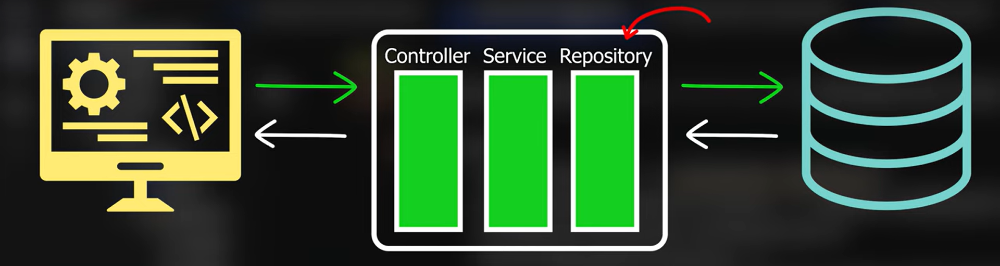
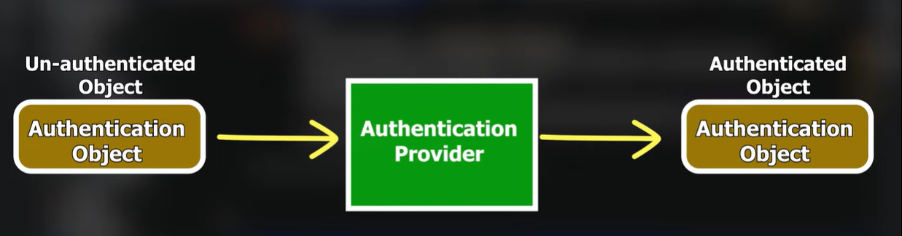

# Verify Users

---


---

### UserDetailsService in Spring Security

- The **UserDetailsService** interface is used to fetch user details from a data source (e.g., database).
- Spring Security provides a default implementation, but we can customize it to use our own logic for user authentication.

### Customizing UserDetailsService
Below is an example of defining a custom **UserDetailsService** using an in-memory user store:

```java
// Returning our own UserDetailsService
@Bean
public UserDetailsService userDetailsService() {
    UserDetails user1 = User
        .withDefaultPasswordEncoder()
        .username("kiran")
        .password("k@123")
        .roles("USER")
        .build();
        
    UserDetails user2 = User
        .withDefaultPasswordEncoder()
        .username("harsh")
        .password("h@123")
        .roles("ADMIN")
        .build();

    return new InMemoryUserDetailsManager(user1, user2);
}
```

### Explanation of the Code
- `UserDetailsService` is implemented using `InMemoryUserDetailsManager`.
- **`User.withDefaultPasswordEncoder()`**: Creates a user with an encoded password.
- **Roles (`USER`, `ADMIN`)**: Define access permissions.
- The service returns two users stored in memory.

### Authentication Process
1. A user logs in, and an **unauthenticated object** is created.
2. This object is passed to an **Authentication Provider**.
3. The provider fetches user details from the **database (or in-memory store)**.
4. If credentials match, the user is authenticated.

---


---

### Authentication Provider
- The **Authentication Provider** is responsible for connecting to the database and verifying user credentials.
- It takes an unauthenticated request and converts it into an authenticated one.


# Verifying User from Database 

### Customizing UserDetailsService
Spring Security provides a `UserDetailsService` interface, which can be customized to fetch user details from a database. This allows authentication to be based on stored user credentials instead of in-memory users.

### Custom UserDetailsService Implementation
Below is an implementation of `UserDetailsService` that fetches user details from a database:

#### `MyUserDetailsService.java`
```java
package com.univate.SpringSecurityEx.service;

import org.springframework.beans.factory.annotation.Autowired;
import org.springframework.security.core.userdetails.UserDetails;
import org.springframework.security.core.userdetails.UserDetailsService;
import org.springframework.security.core.userdetails.UsernameNotFoundException;
import org.springframework.stereotype.Service;

import com.univate.SpringSecurityEx.model.UserPrincipal;
import com.univate.SpringSecurityEx.model.Users;
import com.univate.SpringSecurityEx.repo.UserRepo;

@Service
public class MyUserDetailsService implements UserDetailsService {

    @Autowired
    private UserRepo repo;

    @Override
    public UserDetails loadUserByUsername(String username) throws UsernameNotFoundException {
        Users user = repo.findByUsername(username);
        if(user == null) {
            System.out.println("User not found");
            throw new UsernameNotFoundException("User not found");
        }
        return new UserPrincipal(user);
    }
}
```

### Defining UserPrincipal
The `UserPrincipal` class implements `UserDetails` and is used to represent authenticated users.

#### `UserPrincipal.java`
```java
package com.univate.SpringSecurityEx.model;

import java.util.Collection;
import java.util.Collections;
import org.springframework.security.core.GrantedAuthority;
import org.springframework.security.core.authority.SimpleGrantedAuthority;
import org.springframework.security.core.userdetails.UserDetails;

public class UserPrincipal implements UserDetails {
    private Users user;

    public UserPrincipal(Users user) {
        this.user = user;
    }

    @Override
    public Collection<? extends GrantedAuthority> getAuthorities() {
        return Collections.singleton(new SimpleGrantedAuthority("USER"));
    }

    @Override
    public String getPassword() {
        return user.getPassword();
    }

    @Override
    public String getUsername() {
        return user.getUsername();
    }

    @Override
    public boolean isAccountNonExpired() {
        return true;
    }

    @Override
    public boolean isAccountNonLocked() {
        return true;
    }

    @Override
    public boolean isCredentialsNonExpired() {
        return true;
    }

    @Override
    public boolean isEnabled() {
        return true;
    }
}
```

### User Repository
Spring Data JPA is used to fetch users from the database.

#### `UserRepo.java`
```java
package com.univate.SpringSecurityEx.repo;

import org.springframework.data.jpa.repository.JpaRepository;
import org.springframework.stereotype.Repository;
import com.univate.SpringSecurityEx.model.Users;

@Repository
public interface UserRepo extends JpaRepository<Users, Integer> {
    Users findByUsername(String username);
}
```

### Custom Security Configuration
To use the custom `UserDetailsService`, an authentication provider needs to be defined in the security configuration.

#### `SecurityConfig.java`
```java
package com.univate.SpringSecurityEx.config;

import org.springframework.beans.factory.annotation.Autowired;
import org.springframework.context.annotation.Bean;
import org.springframework.context.annotation.Configuration;
import org.springframework.security.authentication.AuthenticationProvider;
import org.springframework.security.authentication.dao.DaoAuthenticationProvider;
import org.springframework.security.config.Customizer;
import org.springframework.security.config.annotation.web.builders.HttpSecurity;
import org.springframework.security.config.annotation.web.configuration.EnableWebSecurity;
import org.springframework.security.config.http.SessionCreationPolicy;
import org.springframework.security.core.userdetails.UserDetailsService;
import org.springframework.security.crypto.password.NoOpPasswordEncoder;
import org.springframework.security.web.SecurityFilterChain;

@Configuration
@EnableWebSecurity
public class SecurityConfig {

    @Autowired
    private UserDetailsService userDetailsService;
    
    @Bean
    public SecurityFilterChain securityFilterChain(HttpSecurity http) throws Exception {
        http.csrf(customizer -> customizer.disable())
            .authorizeHttpRequests(request -> request.anyRequest().authenticated())
            .formLogin(Customizer.withDefaults())
            .httpBasic(Customizer.withDefaults())
            .sessionManagement(session -> session.sessionCreationPolicy(SessionCreationPolicy.STATELESS));
        return http.build();
    }

    @Bean
    public AuthenticationProvider authenticationProvider() {
        DaoAuthenticationProvider provider = new DaoAuthenticationProvider();
        provider.setPasswordEncoder(NoOpPasswordEncoder.getInstance());
        provider.setUserDetailsService(userDetailsService);
        return provider;
    }
}
```

### Database Configuration
The following properties configure the database connection:
```properties
spring.datasource.url=jdbc:mysql://localhost:3306/<dbname>
spring.datasource.username=<username>
spring.datasource.password<password>
```

---
This setup ensures that users are authenticated from the database, and the security system is fully integrated with Spring Security.

