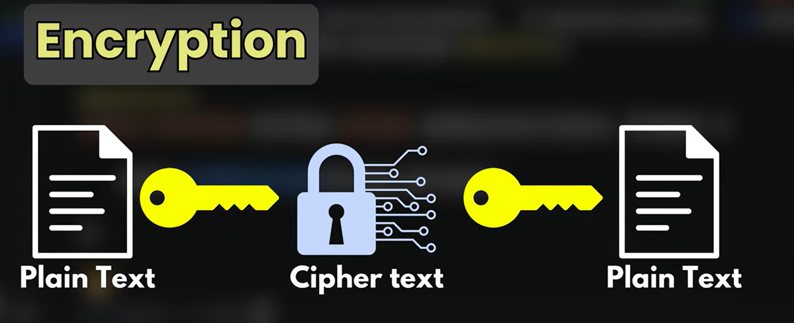
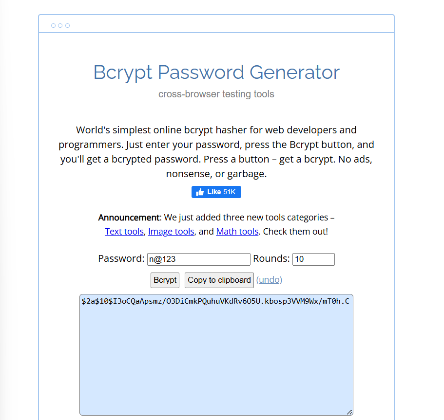

# BCrypt Password Encoder

### Why Use Hashing Instead of Encryption?
When storing passwords, we can either encrypt or hash them. Encryption converts plain text into a cipher using a key, but if the key is leaked, all passwords become vulnerable.



To improve security, instead of encrypting passwords, we use hashing.

### What is Hashing?
Hashing transforms a password into a fixed-length value that cannot be reversed. Unlike encryption, hashing does not require a decryption key. This ensures that even if attackers gain access to the hashed passwords, they cannot easily revert them to their original form.

### Introduction to BCrypt
BCrypt is a hashing algorithm designed for securely storing passwords. It incorporates a salt (random data) before hashing, making it resistant to rainbow table and brute-force attacks. BCrypt is widely used in security frameworks like Spring Security to safeguard user credentials.



In bcrypt, the number of rounds (e.g., 10) means 2 to the power of 10 iterations (1024 iterations), making it computationally expensive to slow down brute-force attacks.

## Using BCryptPasswordEncoder
We use the `BCryptPasswordEncoder` library in Spring Security to hash user passwords before storing them in the database.

## User Registration with Hashed Password

**UserController.java**
```java
package com.univate.SpringSecurityEx.controller;

import org.springframework.beans.factory.annotation.Autowired;
import org.springframework.web.bind.annotation.PostMapping;
import org.springframework.web.bind.annotation.RequestBody;
import org.springframework.web.bind.annotation.RestController;

import com.univate.SpringSecurityEx.model.Users;
import com.univate.SpringSecurityEx.service.UserService;

@RestController
public class UserController {

    @Autowired
    UserService service;
    
    @PostMapping("/register")
    public Users register(@RequestBody Users user) {
        return service.register(user);
    }
}
```

**UserService.java**
```java
package com.univate.SpringSecurityEx.service;

import org.springframework.beans.factory.annotation.Autowired;
import org.springframework.security.crypto.bcrypt.BCryptPasswordEncoder;
import org.springframework.stereotype.Service;

import com.univate.SpringSecurityEx.model.Users;
import com.univate.SpringSecurityEx.repo.UserRepo;

@Service
public class UserService {

    @Autowired // No need to create the object manually
    UserRepo repo;

    private BCryptPasswordEncoder encoder = new BCryptPasswordEncoder(12);

    public Users register(Users user) {
        user.setPassword(encoder.encode(user.getPassword()));
        return repo.save(user);
    }
}
```

## Updating Security Configuration
We need to update the authentication provider to use `BCryptPasswordEncoder` instead of `NoOpPasswordEncoder`.

**SecurityConfig.java**
```java
@Bean
public AuthenticationProvider authenticationProvider() {
    DaoAuthenticationProvider provider = new DaoAuthenticationProvider();
    // provider.setPasswordEncoder(NoOpPasswordEncoder.getInstance()); // No longer needed
    provider.setPasswordEncoder(new BCryptPasswordEncoder(12));
    provider.setUserDetailsService(userDetailsService);
    return provider;
}
```

This ensures that passwords are securely hashed before being stored and correctly validated during authentication.

