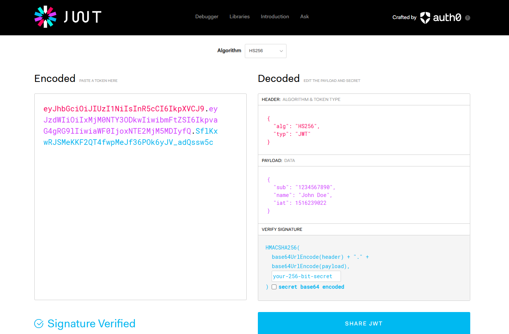
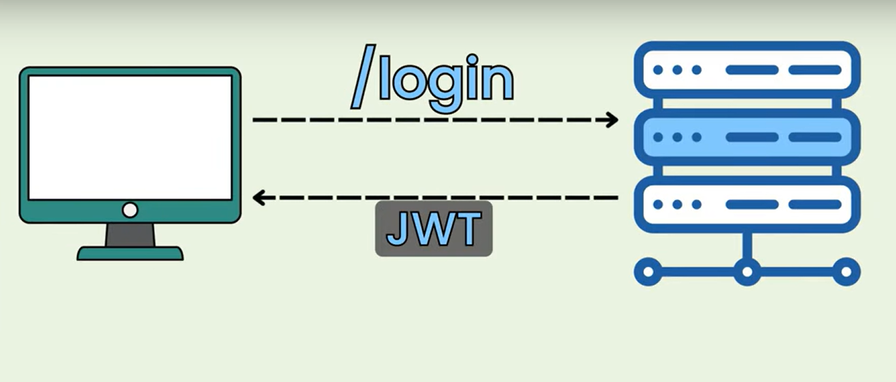

# JSON Web Token (JWT)

---


---
### Purpose of JWT
JWT (JSON Web Token) is a compact, URL-safe means of representing claims between two parties. It is widely used for authentication and authorization in web applications. JWT can be used instead of session-based authentication to maintain a stateless authentication system.

### XML vs. JSON in Token-Based Authentication
Tokens can be represented in both XML and JSON formats. While XML-based tokens, like SAML (Security Assertion Markup Language), are used in enterprise systems, JWT uses JSON, which is lighter, more flexible, and commonly used in modern web applications.

### Asymmetric vs. Symmetric Algorithms

**Symmetric Algorithm:** Uses a single secret key for both signing and verifying the token. This means the same key must be shared between the issuer and the verifier, which can pose security risks.
- Examples: HMAC (HS256, HS512)

**Asymmetric Algorithm:** Uses a pair of public and private keys. The private key is used to sign the token, while the public key is used for verification.
- Examples: RSA (RS256, RS512), ECDSA (ES256, ES512)

### Structure of a JWT
A JWT consists of three parts separated by dots (`.`):
1. **Header** – Contains metadata about the token, such as the signing algorithm used.
2. **Payload** – Contains claims (statements about the user or token expiration details).
3. **Signature** – Ensures the token has not been tampered with and is generated using the header and payload.



### Use of JWT
- **Authentication:** Used in token-based authentication systems, replacing session-based authentication.
- **Authorization:** Determines access control by embedding user roles and permissions.
- **Data Integrity:** Ensures the token has not been modified during transmission.
- **Stateless Communication:** Allows API authentication without requiring server-side session storage.

JWT is widely used in modern applications, particularly in RESTful APIs, mobile applications, and microservices architecture.

---


---

### **Understanding UPAF (Username-Password Authentication Flow)**
UPAF (Username-Password Authentication Flow) is a common authentication mechanism where:
1. The user submits a **username and password**.
2. The backend **verifies** the credentials against a database.
3. If valid, the backend **generates a JWT** and returns it to the client.
4. The client stores the JWT and sends it with **each request**.
5. The backend **verifies the JWT** before processing protected requests.

---

## **Step-by-Step JWT Authentication in Spring Boot**
Let’s break down how your implementation works.

---

### **1️⃣ Get JWT (User Authentication)**
When a user logs in, the `UserService.verify()` method is called:

```java
public String verify(Users user) {
    Authentication authentication = authManager.authenticate(
        new UsernamePasswordAuthenticationToken(user.getUsername(), user.getPassword())
    );

    if (authentication.isAuthenticated()) {
        return jwtService.generateToken(user.getUsername());
    } else {
        return "fail";
    }
}
```
✅ **Steps in this method**:
- **Authenticate the user** using `UsernamePasswordAuthenticationToken`.
- If authentication **succeeds**, generate a **JWT token**.
- Return the **JWT token** to the client.

---

### **2️⃣ Generate JWT**
The `JWTService.generateToken()` method creates a JWT for the authenticated user.

```java
public String generateToken(String username) {
    Map<String, Object> claims = new HashMap<>();
    return Jwts.builder()
            .setClaims(claims)
            .setSubject(username)
            .setIssuedAt(new Date(System.currentTimeMillis()))
            .setExpiration(new Date(System.currentTimeMillis() + 1000 * 60 * 30)) // 30 minutes expiry
            .signWith(getKey(), SignatureAlgorithm.HS256) 
            .compact();
}
```

✅ **Steps in this method**:
1. Set **claims** (user-related data).
2. Set **subject** (username).
3. Set **issued date** and **expiration time**.
4. **Sign** with `HS256` algorithm using a secret key.
5. **Return** the compact JWT string.

---

### **3️⃣ Validate JWT (Middleware Filtering)**
Every request passes through `JwtFilter`, which checks if the token is valid.

#### **JwtFilter.java**
```java
@Override
protected void doFilterInternal(HttpServletRequest request, HttpServletResponse response, FilterChain filterChain)
        throws ServletException, IOException {

    String authHeader = request.getHeader("Authorization");
    String token = null;
    String username = null;

    if (authHeader != null && authHeader.startsWith("Bearer ")) {
        token = authHeader.substring(7);
        username = jwtService.extractUserName(token);
    }

    if (username != null && SecurityContextHolder.getContext().getAuthentication() == null) {

        UserDetails userDetails = context.getBean(MyUserDetailsService.class).loadUserByUsername(username);

        if (jwtService.validateToken(token, userDetails)) {

            UsernamePasswordAuthenticationToken authToken = 
                new UsernamePasswordAuthenticationToken(userDetails, null, userDetails.getAuthorities());

            authToken.setDetails(new WebAuthenticationDetailsSource().buildDetails(request));

            SecurityContextHolder.getContext().setAuthentication(authToken);
        }
    }

    filterChain.doFilter(request, response);
}
```

✅ **Steps in this method**:
1. Extract **JWT token** from the **Authorization** header.
2. Extract the **username** from the token.
3. If the username is valid and no authentication exists, load **UserDetails** from the database.
4. **Verify** the JWT token.
5. If valid, create an `Authentication` object and **set it in the SecurityContext**.

---

### **4️⃣ Verify JWT**
The `JWTService.validateToken()` method ensures the JWT belongs to the correct user.

```java
public boolean validateToken(String token, UserDetails userDetails) {
    final String userName = extractUserName(token);
    return (userName.equals(userDetails.getUsername()) && !isTokenExpired(token));
}
```

✅ **Steps in this method**:
- Extract username from JWT.
- Compare with `UserDetails` username.
- Check if the token **is not expired**.

---

### **5️⃣ Extract Data from JWT**
The `JWTService.extractUserName()` method gets the username from the JWT.

```java
public String extractUserName(String token) {
    return extractClaim(token, Claims::getSubject);
}
```
✅ **Steps in this method**:
- Use **Claims** to extract the **subject** (username) from the JWT.

---

### **6️⃣ Secure Endpoints with Spring Security**
The security configuration ensures only authenticated users can access endpoints.

#### **Security Configuration**
```java
@Bean
public SecurityFilterChain securityFilterChain(HttpSecurity http) throws Exception {
    http.csrf(csrf -> csrf.disable())
        .authorizeHttpRequests(auth -> auth
            .requestMatchers("register", "login").permitAll() // Allow login & register
            .anyRequest().authenticated()) // Protect all other endpoints
        .httpBasic(Customizer.withDefaults()) // Enable HTTP basic auth
        .sessionManagement(session -> session.sessionCreationPolicy(SessionCreationPolicy.STATELESS))
        .addFilterBefore(jwtFilter, UsernamePasswordAuthenticationFilter.class);

    return http.build();
}
```

✅ **Steps in this method**:
- **Disable CSRF** (as JWT is stateless).
- **Allow access** to `/register` and `/login` without authentication.
- **Protect** all other endpoints.
- **Enable Stateless Sessions**.
- **Add JWT Filter** before `UsernamePasswordAuthenticationFilter`.

---

## **Final Authentication Flow**
#### **Step-by-Step JWT Authentication Process**
1️⃣ **User logs in** with username & password.  
2️⃣ Backend **authenticates user** with database.  
3️⃣ If successful, backend **generates a JWT** and returns it.  
4️⃣ User **sends JWT** with every request (`Authorization: Bearer <JWT>`).  
5️⃣ `JwtFilter` **extracts the JWT** and verifies it.  
6️⃣ If valid, backend **sets authentication in the SecurityContext**.  
7️⃣ Protected endpoints can now be **accessed** securely.  
